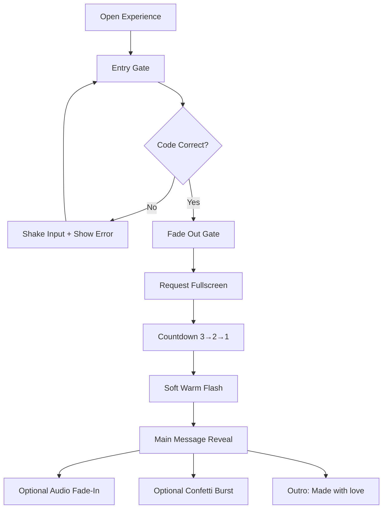

## 1. Product Overview
A full-screen, cinematic, interactive Mother’s Day digital gift with a secret-code entry gate, a dramatic countdown transition, and an emotional message reveal with elegant motion and atmosphere.
- Purpose: deliver a heartfelt, memorable “mini experience” rather than a static card
- Target user: a single recipient (Mom) opening on phone or desktop via a shared link

## 2. Core Features

### 2.1 Feature Module
1. **Entry Gate (Secret Code)**: locked screen UI, code validation, error feedback, unlock transition, fullscreen request
2. **Countdown Transition**: cinematic dark scene, glowing 3→2→1 timer, particles, soft flash transition
3. **Main Message Scene**: gradient romantic background, floating hearts/particles, parallax motion, animated text sequence, editable custom message block, optional confetti burst
4. **Audio Layer (Optional)**: ambient/piano track with smooth fade-in after countdown, minimal mute toggle
5. **Final Touch Screen**: “Made with love ❤️” outro, subtle heart float, graceful fade-out

### 2.2 Page Details
| Page Name | Module Name | Feature description |
|-----------|-------------|---------------------|
| Experience (single page) | Scene Controller | Manages scene state transitions (Gate → Countdown → Message → Outro), orchestrates animation timelines, handles reduced-motion preference |
| Experience (single page) | Entry Gate | Title + masked/normal input + unlock button; incorrect: shake + red error; correct: fade out and advance |
| Experience (single page) | Fullscreen | On successful unlock, requestFullscreen() and keep “immersive” layout; allow user to exit via system gestures/ESC |
| Experience (single page) | Countdown | 3→2→1 centered glowing numerals, pulse, background blur and particles, soft warm flash on completion |
| Experience (single page) | Message | Staggered text reveals (fade + slide up), glow/bloom on headline, editable custom message block |
| Experience (single page) | Atmosphere | Floating particles/hearts, subtle grain/noise overlay, vignette, parallax motion on pointer move (desktop) and device tilt or scroll (mobile fallback) |
| Experience (single page) | Confetti (optional) | One-time subtle burst when the main message arrives |
| Experience (single page) | Audio (optional) | Starts after countdown, fades volume in; mute toggle persists for the session |
| Experience (single page) | Outro | “Made with love ❤️” with slow fade-in, then optional fade-out to black |

## 3. Core Process
User flow:
1. Open the link → see a locked “Enter Access Code” screen
2. Enter code → if wrong, input shakes + error text appears
3. Enter correct code → gate fades out, app requests fullscreen, cinematic countdown starts
4. Countdown completes → soft warm flash → main message reveals with audio fade-in (if enabled)
5. User lingers/interacts with parallax → then proceeds to the final “Made with love” screen

## 4. User Interface Design

### 4.1 Design Style
- Visual direction: cinematic romance + glassmorphism + gentle “memory film” atmosphere (vignette + soft grain)
- Primary colors: Pink (#ff6fae), Lavender (#a78bfa)
- Background tones: Warm white (#fff5f8) and warm gold (#ffd6a5) as highlights
- Accents: subtle gold glints and warm highlights on headings and key moments (flash transition)
- Typography: Playfair Display (headings) + Poppins (body), with generous letter-spacing and fluid type scaling
- Layout: full-screen centered compositions, minimal UI chrome, rounded glass panels and soft shadowing
- Motion: smooth easing, staged reveals, no abrupt cuts; prefer subtle, premium animation over busy motion

### 4.2 Page Design Overview
| Page Name | Module Name | UI Elements |
|-----------|-------------|-------------|
| Experience (single page) | Entry Gate | Centered glass panel; title; input with focus glow; “Unlock” button with hover sheen; error text in soft red; shake animation on invalid |
| Experience (single page) | Countdown | Dark blurred background with floating particles; giant glowing numerals; pulse + glow breathing; subtle screen bloom; warm flash at end |
| Experience (single page) | Message | Gradient mesh background (pink→purple→gold); hearts/particles drifting; headline glow; staggered lines; custom message block in glass card; gentle parallax |
| Experience (single page) | Audio | Minimal icon button in corner (muted/unmuted); fades in/out smoothly |
| Experience (single page) | Outro | Centered line “Made with love ❤️”; slow fade and drifting hearts |

### 4.3 Responsiveness
- Desktop-first composition with fluid scaling: typography and spacing adapt via CSS clamp()
- Mobile: larger tap targets, reduced particle density, simplified parallax (tilt/scroll fallback)
- Accessibility: respects prefers-reduced-motion; sufficient contrast for text; focus states visible on input/button

