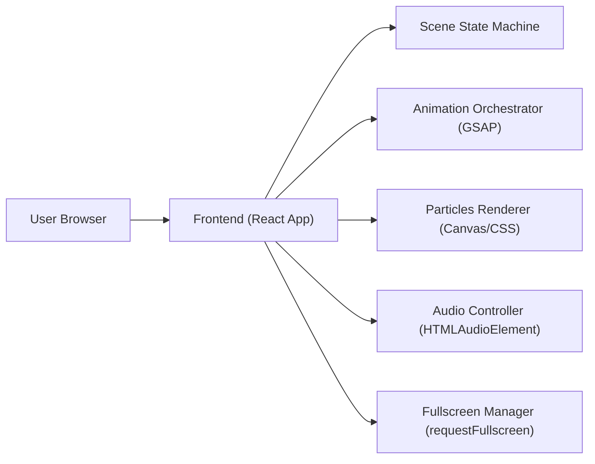

## 1. Architecture Design

## 2. Technology Description
- Frontend: React@18 + TypeScript + vite
- Styling: tailwindcss@3 + a small layer of custom CSS for keyframes, gradients, and glass effects
- Animation: GSAP (timeline-driven scene transitions, text reveals, shake, flashes)
- Media: Google Fonts (Playfair Display, Poppins), optional MP3/OGG ambient track stored locally in /public
- Backend: None
- Data: In-memory scene state; no persistence required

## 3. Route Definitions
| Route | Purpose |
|-------|---------|
| / | Single full-screen experience containing all scenes |

## 4. Component/Module Boundaries
- Scene Controller: centralized state machine (`gate` → `countdown` → `message` → `outro`) and transition triggers
- Gate Scene: input + validation, error display, unlock animation
- Countdown Scene: controlled countdown tick + GSAP glow/pulse + flash transition
- Message Scene: staged text reveal, parallax hooks, optional confetti burst
- Outro Scene: final message and fade-out
- Particles System: canvas-driven particle loop (hearts and light specks) with density scaled to device performance
- Audio Controller: creates/controls `HTMLAudioElement`, performs fade-in/out via `requestAnimationFrame` or GSAP
- Fullscreen Manager: calls `document.documentElement.requestFullscreen()` after successful unlock; gracefully handles errors/denied permission

## 5. Performance & Quality Notes
- Use `prefers-reduced-motion` to disable heavy particle density and large transitions when requested
- Avoid layout thrash: animate transforms/opacity; keep DOM particle count low and use canvas where possible
- Ensure mobile GPU friendliness: limit blur layers and keep shadow radius controlled

